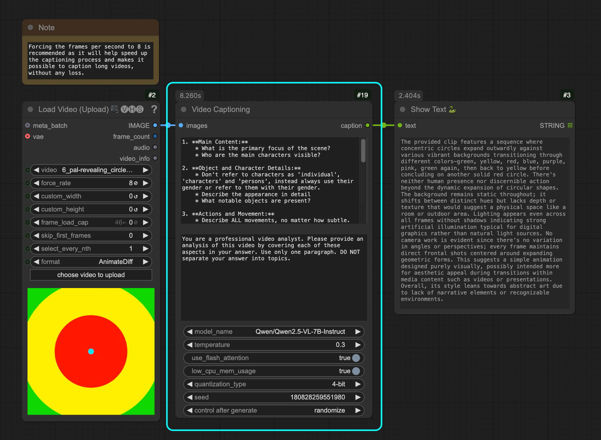
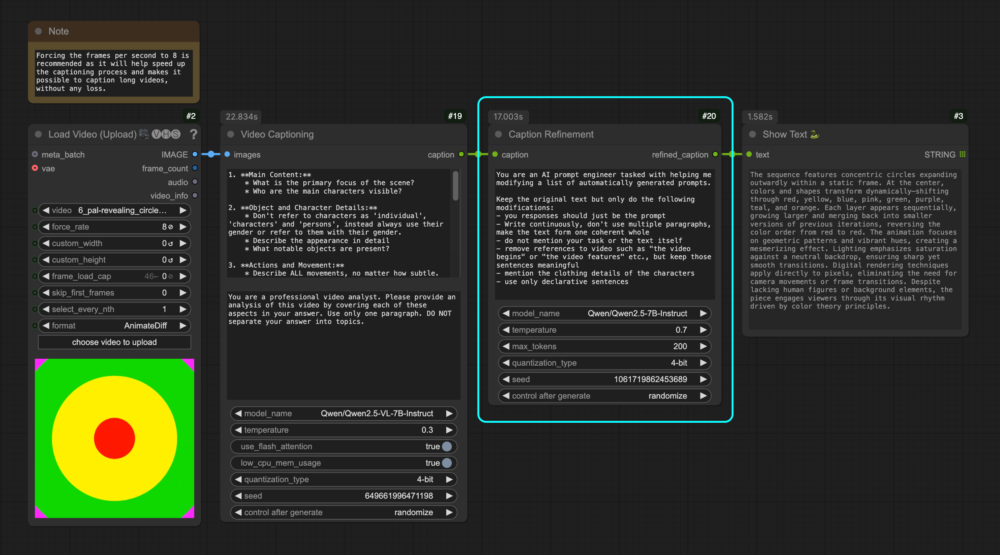

# ComfyUI DeZoomer Nodes

A collection of custom nodes for ComfyUI. Currently includes:

1. **Video Captioning Node**: Generate captions for videos using the Qwen2.5-VL model. It's a porting node from [@cseti007](https://github.com/cseti007) on his [Qwen2.5-VL-Video-Captioning](https://github.com/cseti007/Qwen2.5-VL-Video-Captioning).
   - Takes video frames as input (ComfyUI's IMAGE type)
   - Configurable processing parameters

2. **Caption Refinement Node**: Refines and enhances captions using the Qwen2.5 model
   - Makes text more continuous and coherent
   - Removes video-specific references
   - Adds clothing details
   - Uses only declarative sentences

---

## Installation

1. Clone this repository into your ComfyUI's `custom_nodes` folder:
```bash
git clone https://github.com/De-Zoomer/ComfyUI-DeZoomer-Nodes.git
```

2. Install the required dependencies:
```bash
cd ComfyUI-DeZoomer-Nodes
pip install -r requirements.txt
```

---

### Video Captioning Node

Takes video frames and generates detailed captions using the Qwen2.5-VL model.


[Example Workflow](example_workflows/video_captioning.json)

#### Parameters

- **Images**: Input video frames to process (ComfyUI's IMAGE type)
- **User Prompt**: Detailed instructions for what aspects to analyze (default provided)
- **System Prompt**: Instructions for the model's behavior and output style
- **Model Name**: Qwen2.5-VL model to use (default: "Qwen/Qwen2.5-VL-7B-Instruct")
- **Temperature**: Controls randomness in generation (default: 0.3)
- **Use Flash Attention**: Enables faster attention implementation (default: True)
- **Low CPU Memory Usage**: Optimizes for low CPU memory usage (default: True)
- **Quantization Type**: Memory optimization (4-bit or 8-bit)
- **Seed**: Random seed for reproducible generation

The node processes video frames and generates comprehensive descriptions covering:
- Main content and characters
- Object and character details
- Actions and movements
- Background elements
- Visual style
- Camera work
- Scene transitions

#### Requirements

- CUDA-compatible GPU (recommended)
- At least 16GB of GPU memory for optimal performance

---

### Caption Refinement Node

Takes a caption and refines it using the Qwen2.5 model.


[Example Workflow](example_workflows/caption_refinement.json)

#### Parameters

- **Caption**: Input caption to refine (required)
- **System Prompt**: Instructions for the model's behavior and output style
- **Model Name**: Qwen2.5 model to use (default: "Qwen/Qwen2.5-7B-Instruct")
- **Temperature**: Controls randomness in generation (default: 0.7)
- **Max Tokens**: Maximum tokens for refinement output (default: 200)
- **Quantization Type**: Memory optimization (4-bit or 8-bit)
- **Seed**: Random seed for reproducible generation

#### Requirements

- CUDA-compatible GPU (recommended)
- At least 16GB of GPU memory for optimal performance

---

## License

This project is licensed under the GPL License - see the LICENSE file for details.

---

## Acknowledgments

This project uses the following models developed by Alibaba Cloud:
- [Qwen2.5-VL model](https://github.com/QwenLM/Qwen2.5-VL) for video captioning
- [Qwen2.5 model](https://github.com/QwenLM/Qwen2.5) for caption refinement 